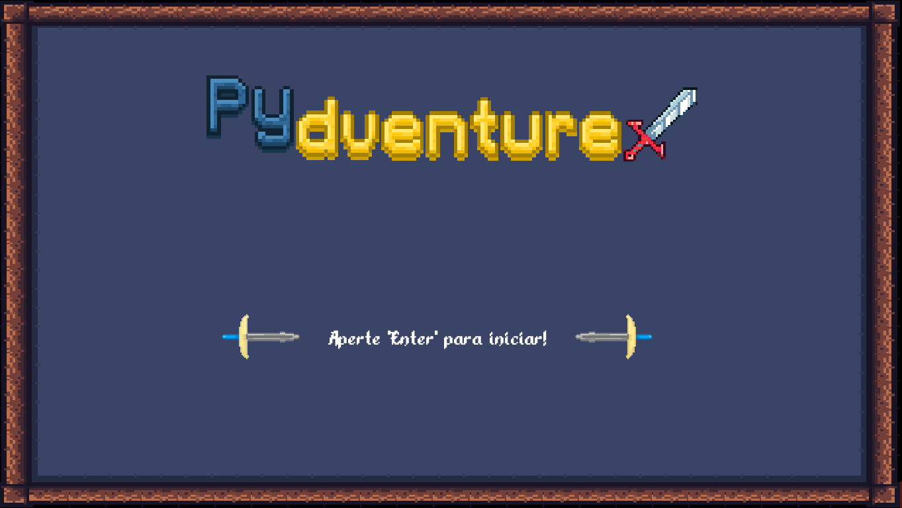

# Pydventure



> Este jogo de plataforma possui o objetivo de servir como suporte para o aprendizado de programação da linguagem Python.

## 💻 Pré-requisitos

Antes de começar, verifique se você atendeu aos seguintes requisitos:
<!---Estes são apenas requisitos de exemplo. Adicionar, duplicar ou remover conforme necessário--->
* Você tem uma máquina `<Windows / Linux>`.

## 🚀 Instalando o Pydventure

Para jogar o Pydventure, siga estas etapas:

Windows:
```
1. Baixe o seguinte arquivo zip: https://drive.google.com/file/d/11Midn8E3JgMtAEnjRs6oL13FYLMULsIh/view?usp=sharing
2. Descompacte e abra a pasta
3. Abra o arquivo no formato .exe (NÃO É O ARQUIVO PCK)
```

Linux:
```
1. Baixe o seguinte arquivo zip: https://drive.google.com/file/d/15UEREeNpqnprMQ1nkkhC_lA4N-vOMlNV/view?usp=sharing
2. Descompacte e abra a pasta
3. Abra o arquivo no formato .x86_64 (NÃO É O ARQUIVO PCK)
```

## 📫 Contribuindo para Pydventure
<!---Se o seu README for longo ou se você tiver algum processo ou etapas específicas que deseja que os contribuidores sigam, considere a criação de um arquivo CONTRIBUTING.md separado--->
Para contribuir com Pydventure, siga estas etapas:

1. Bifurque este repositório.
2. Crie um branch: `git checkout -b <nome_branch>`.
3. Faça suas alterações e confirme-as: `git commit -m '<mensagem_commit>'`
4. Envie para o branch original: `git push origin <nome_do_projeto> / <local>`
5. Crie a solicitação de pull.

Como alternativa, consulte a documentação do GitHub em [como criar uma solicitação pull](https://help.github.com/en/github/collaborating-with-issues-and-pull-requests/creating-a-pull-request).

<!--
## 🤝 Colaboradores

Agradecemos às seguintes pessoas que contribuíram para este projeto:

<table>
  <tr>
    <td align="center">
      <a href="#">
        <br>
        <sub>
          <b>Iuri Silva</b>
        </sub>
      </a>
    </td>
    <td align="center">
      <a href="#">
        <br>
        <sub>
          <b>Mark Zuckerberg</b>
        </sub>
      </a>
    </td>
    <td align="center">
      <a href="#">
        <br>
        <sub>
          <b>Steve Jobs</b>
        </sub>
      </a>
    </td>
  </tr>
</table>
-->


## 😄 Sugestão de Melhorias <br>

O projeto foi, por hora, finalizado e os tópicos abaixo envolvem os futuros trabalhos possíveis:

- [ ] Fase para o ensino de listas
- [ ] Cenas com animação de sprites em Pixel Art
- [ ] Fases com músicas e objetos e personagens com efeitos sonoros
- [ ] Plataforma web com ranking

## 📝 Licença

Esse README foi baseado no template criado por <a href="https://github.com/iuricode">Iuri Silva</a>. Link do template <a href="https://github.com/iuricode/readme-template/blob/main/repository/repository.md">aqui.</a>.
